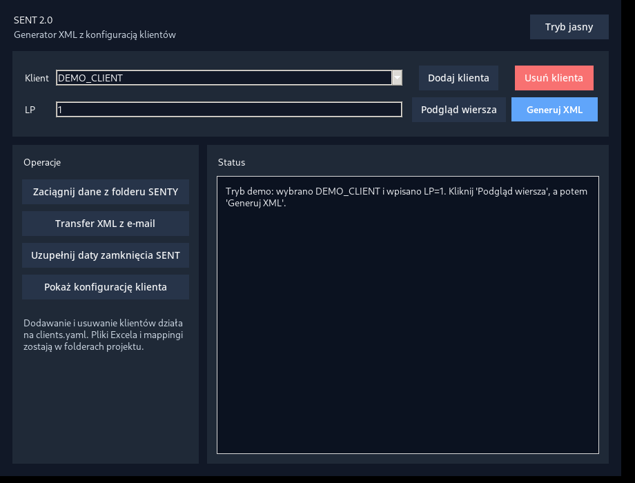

# SENT XML Generator

Desktop application for generating XML documents compliant with the Polish SENT system based on Excel spreadsheets.

The project was designed for configurable document generation using client-specific mappings and XSD schemas, making it easy to support multiple data sources without modifying the application logic.

> **Note**
> This repository contains a fully anonymized demonstration version. All client data, mappings, identifiers, and example files have been replaced with fictional values.

---

## Features

- Desktop GUI built with Tkinter
- XML generation from Excel spreadsheets
- Validation against official XSD schemas
- Client-based configuration (`clients.yaml`)
- YAML mapping layer between Excel columns and XML fields
- Automatic XML structure generation
- Import of SENT information from HTML/XML files
- Optional Outlook integration for XML transfer
- Automatic document ID generation
- Support for multiple clients without code changes
- Demo configuration included

---

## Tech Stack

- Python 3.11+
- Tkinter
- pandas
- openpyxl
- lxml
- PyYAML
- pywin32 (optional, Outlook integration)

---

## Project Structure

```
.
├── excels/
├── mappings/
├── output/
├── schemas/
├── config.py
├── excel_service.py
├── outlook_service.py
├── xml_builder.py
├── gui.py
├── main.py
└── clients.yaml
```

---

## Installation

Clone the repository:

```bash
git clone https://github.com/yourusername/sent-xml-generator.git
cd sent-xml-generator
```

Install dependencies:

```bash
pip install -r requirements.txt
```

Run the application:

```bash
python main.py
```

---

## Demo

The repository contains a demo configuration that allows running the application without any production data.

The demo includes:

- Demo client
- Example Excel workbook
- Example mappings
- XSD schemas
- Sample XML generation

---

## Screenshots




---

## Architecture

The application separates business logic from configuration:

```
Excel
      │
      ▼
Configuration (YAML)
      │
      ▼
Mapping Engine
      │
      ▼
XML Builder
      │
      ▼
XSD Validation
      │
      ▼
Generated XML
```

This approach allows onboarding new clients by creating configuration files instead of modifying application code.

---

## Disclaimer

This project is published for portfolio and educational purposes.

All business data, client names, identifiers, e-mail addresses, mappings, and examples have been anonymized. The repository does not contain production data.

---

## License

MIT License
